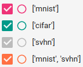
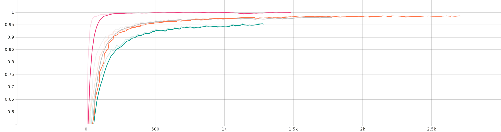
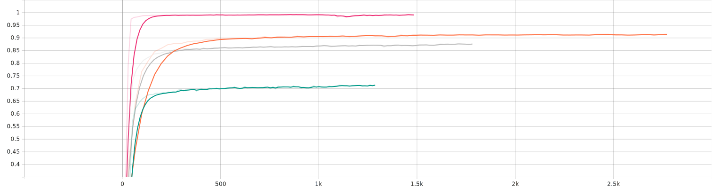
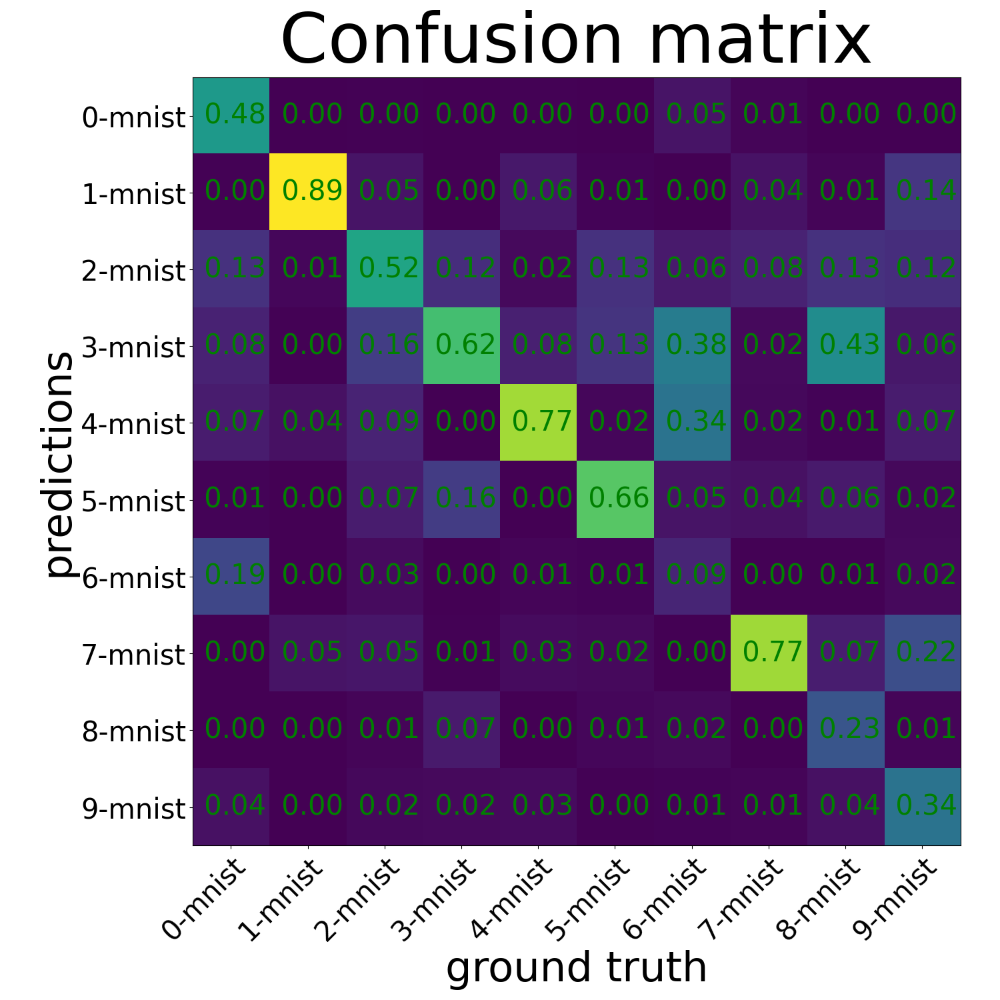
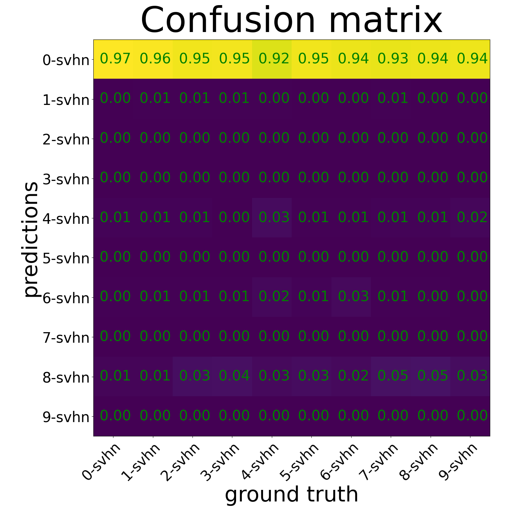
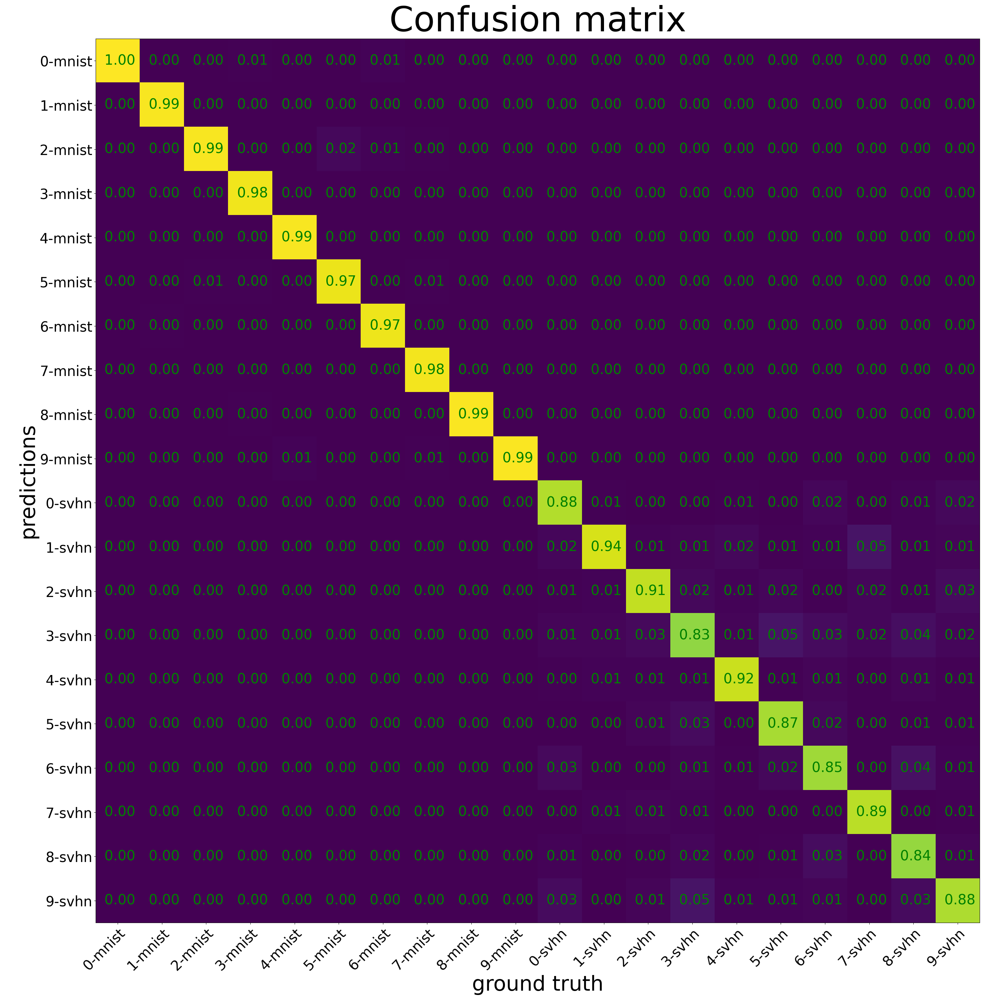

# Classification from multiple sets
This repository contains code to do 3 things:
- train separate:
  - MNIST model
  - SVHN model
  - CIFAR10 model
- evaluate on type of a model on other dataset
- train jointly on several datasets

To reproduce all experiments run: `reproduce.sh`. \
Custom training on `train.py`. \
Evaluate on model on another: `test_one_on_another.py`.

# Training curves
The results are the following:
- MNIST model gets 99+% accuracy on validation set
- CIFAR model gets 70+% accuracy on validation set
- SVHN model gets 87.5% accuracy on validation set

## Legend 

## Train set

## Validation set

# Domain shift
After training the model on SVNH data it is evaluated on MNIST. As we can see the model is fairly robust and can classify the images fairy well with 0.541796875 accuracy and 1.91403 loss. This is probably due to the fact that something like an MNIST digit can be found in street numbers. Some digits work best such as 1, but others such as 6 are not that good.

After training the model on MNIST data it is evaluated on SVNG. As we can see the model does not handle the domain shift well with 0.073983 accuracy and 2.3690145 loss. This is probably due to the fact that there is no color in MNIST dataset. Everything is predicted as 0.

# Joint training
The repository enables joint training on all combinations of the above 3 datasets (MNIST, SVHN, CIFAR10). Here is the confusion matrix for MNIST and SVHN:

The model seems to behave like a classifier which forwards the image to one of the two submodels (one for MNIST one for SVHN). This is probably due to the fact that it is easy to distinguish MNIST digit from SVHN digit (based on color).
